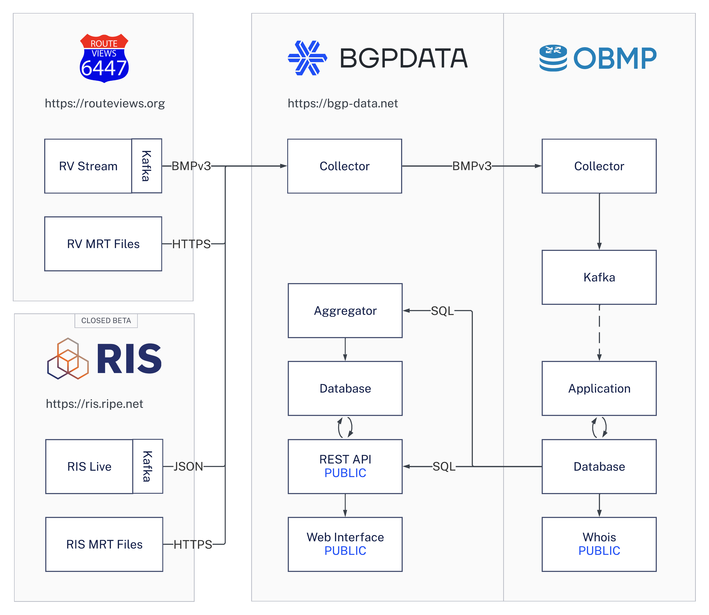

<br />
<br />

---

[https://bgp-data.net](https://bgp-data.net/?ref=github) — BGP Data Collection and Analytics Service

BGPDATA helps researchers and network operators gain insights into their networks by providing a scalable and reliable way to analyze and inspect historical and live BGP data from [Route Views](https://www.routeviews.org/) and [RIPE NCC RIS](https://ris.ripe.net/).

## Data Flow
We collect both historical and live BGP data from [Route Views](https://www.routeviews.org/) and [RIPE NCC RIS](https://ris.ripe.net/) collectors to provide comprehensive insights. 



## Prerequisites

Before you begin, ensure you have the following installed on your system:

-   [Docker](https://docs.docker.com/get-docker/)
-   [Docker Compose](https://docs.docker.com/compose/install/)
-   [Git](https://git-scm.com/book/en/v2/Getting-Started-Installing-Git)

## Getting Started

Follow these instructions to get the project up and running on your local machine.

### Clone the Repository

First, clone the repository to your local machine:

```sh
git clone git@github.com:bgpdata/bgpdata.git
cd bgpdata
```

### Project Structure

The project directory contains the following files:

-   `Dockerfile`: Dockerfile for building the application image.
-   `docker-compose.yaml`: Docker Compose file to set up the application and OpenBMP services.
-   `requirements.txt`: List of Python dependencies for the application.
-   `app.py`: The application code.
-   `Makefile`: Makefile for building and starting the services.

### Build and Start the Services

To build and start BGPDATA, run the following command in the project directory:

```sh
make up
```

This command will:

1. Build the Docker image for the various services.
2. Start the services and initialize the Databases.
3. Serve a user interface at [`http://localhost:8080`](http://localhost:8080)
4. And begin the data collection process from [Route Views](https://www.routeviews.org/) and [RIPE NCC RIS](https://ris.ripe.net/) collectors.

### Accessing the Application

Once the services are up and running, you can access the user interface at [`http://localhost:8080`](http://localhost:8080).
We also provide a REST API at [`http://localhost:8080/api/v1/`](http://localhost:8080/api/v1/) for programmatic access to the data (coming soon).
As well as a Grafana dashboard at [`http://localhost:3000`](http://localhost:3000) to visualize the data and performance metrics (internal only).

# ACKs

-   [RIS](https://ris.ripe.net/) for providing the data and collector infrastructure
-   [Route Views](https://www.routeviews.org/) for providing the data and collector infrastructure
-   [OpenBMP](https://www.openbmp.org/) for providing the invaluable OpenBMP Suite used in-depth in this project
-   [Tim Evens](https://github.com/TimEvens) for his leading role in the development of the OpenBMP Suite
-   [RIPEstat](https://stat.ripe.net/) for their incredible infrastructure and data visualization
-   [RIPE Atlas](https://atlas.ripe.net/) for providing the RIPE Atlas infrastructure and providing mesaurement data for this project
-   [Massimo Candela](https://www.linkedin.com/in/massimocandela) for his outstanding work on [BGPlay](https://bgplayjs.com/)
-   [Christian Teuschel](https://www.linkedin.com/in/cteuschel/) for his inspiration for this project and operation of RIPEstat at the RIPE NCC
-   [Ben Cartwright-Cox](https://benjojo.co.uk/) for the development of [BGP.tools](https://bgp.tools/) and service to the Internet Community
-   [CAIDA BGPStream](https://bgpstream.caida.org/) for providing a versatile BGP data streaming library
-   [Postmark](https://postmarkapp.com/) for providing the email service

## License

See [LICENSE](LICENSE)
